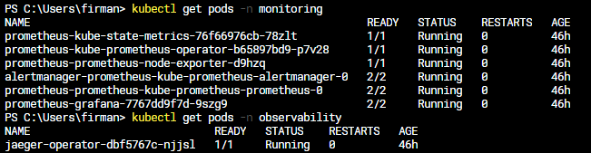
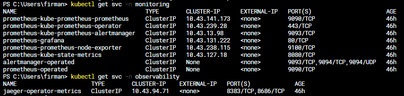
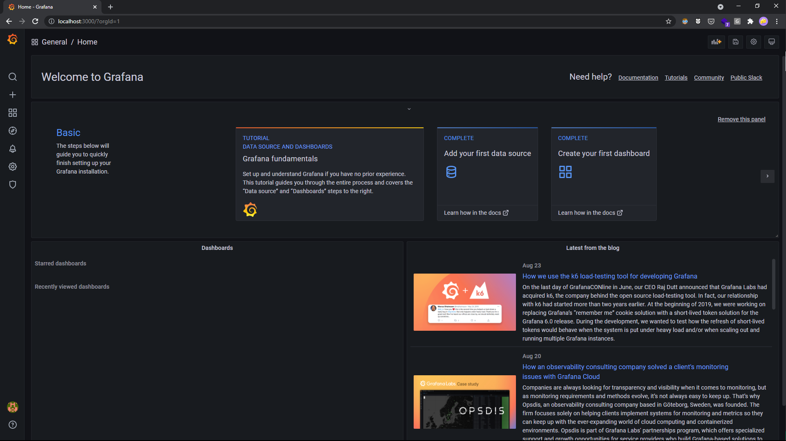
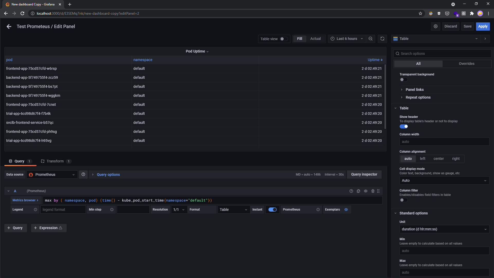
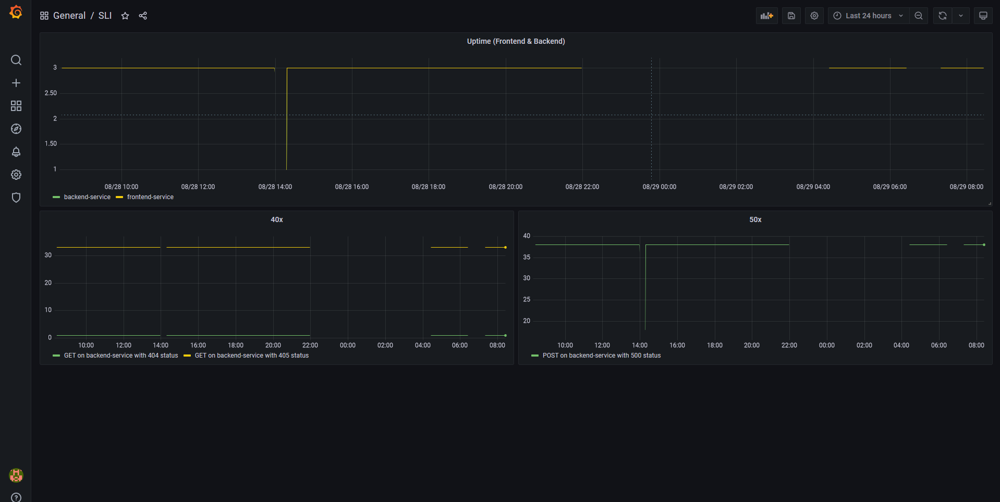
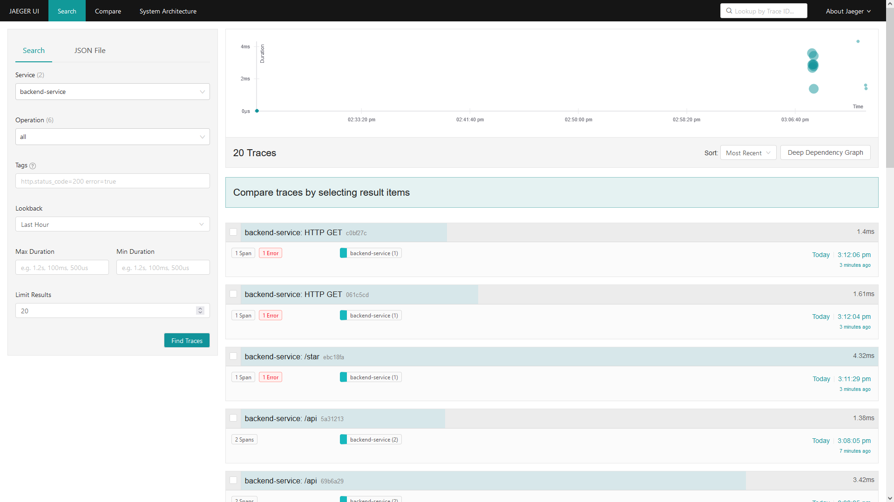
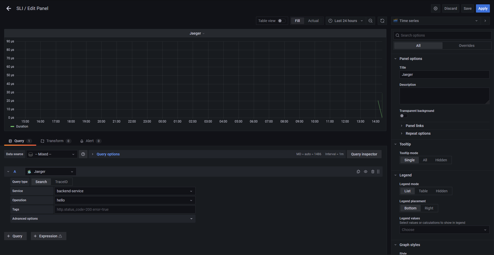
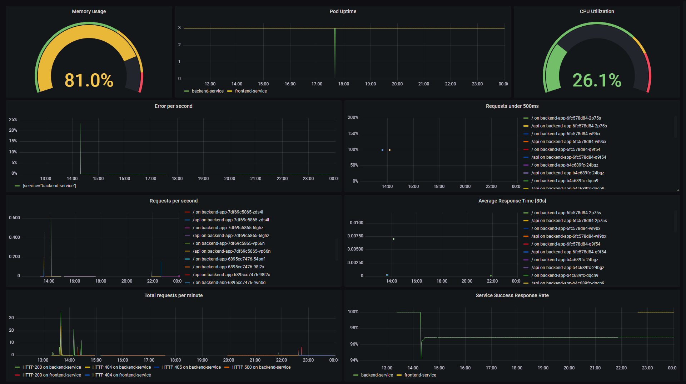

**Note:** For the screenshots, you can store all of your answer images in the `answer-img` directory.

## Verify the monitoring installation

*TODO:* run `kubectl` command to show the running pods and services for the three components. Copy and paste the output or take a screenshot of the output and include it here to verify the installation

### Pods

### Services

## Setup the Jaeger and Prometheus source
*TODO:* Expose Grafana to the internet and then setup Prometheus as a data source. Provide a screenshot of the home page after logging into Grafana.

## Create a Basic Dashboard
*TODO:* Create a dashboard in Grafana that shows Prometheus as a source. Take a screenshot and include it here.

## Describe SLO/SLI
*TODO:* Describe, in your own words, what the SLIs are, based on an SLO of *monthly uptime* and *request response time*.

A specific metric used to measure performance of the service. ie.
- Backend service have 99.99% uptime in the month
- Response time for frontend service less than 0.5 second for 99.99% request

## Creating SLI metrics.
*TODO:* It is important to know why we want to measure certain metrics for our customer. Describe in detail 5 metrics to measure these SLIs. 

- Uptime — Percentage of time of a machine / service has been working and available.
- Latency — The time taken to serve a request (usually measured in ms).
- Traffic — The amount of stress on a system from demand (such as the number of HTTP requests/second).
- Errors — The number of requests that are failing (such as number of HTTP 50x responses).
- Saturation — The overall capacity of a service (such as the percentage of memory or CPU used).

(Uptime definition from Wikipedia. Definition of four golden signals from Udacity material)

## Create a Dashboard to measure our SLIs
*TODO:* Create a dashboard to measure the uptime of the frontend and backend services We will also want to measure to measure 40x and 50x errors. Create a dashboard that show these values over a 24 hour period and take a screenshot.

## Tracing our Flask App
*TODO:*  We will create a Jaeger span to measure the processes on the backend. Once you fill in the span, provide a screenshot of it here.

## Jaeger in Dashboards
*TODO:* Now that the trace is running, let's add the metric to our current Grafana dashboard. Once this is completed, provide a screenshot of it here.

## Report Error
*TODO:* Using the template below, write a trouble ticket for the developers, to explain the errors that you are seeing (400, 500, latency) and to let them know the file that is causing the issue.

TROUBLE TICKET

Name: POST /star request on Backend Service 500 Error

Date: September 2 2021, 15:11:29.714

Subject: MongoDB that required by Backend Service is inaccessible

Affected Area: Backend Service

Severity: High

Description: /star endpoint in backend service is supposed to be able to process POST request and to process it need MongoDB service in example-mongodb-svc.default.svc.cluster.local. But MongoDB service is not accessible from backend service and can not by found in the cluster. 

## Creating SLIs and SLOs
*TODO:* We want to create an SLO guaranteeing that our application has a 99.95% uptime per month. Name three SLIs that you would use to measure the success of this SLO.

- Service uptime should >= 99.999 %
- Service latency should less than 0.5 seconds for >= 99.99% requests
- Service with success response should be more than 99.99% request

## Building KPIs for our plan
*TODO*: Now that we have our SLIs and SLOs, create KPIs to accurately measure these metrics. We will make a dashboard for this, but first write them down here.

- CPU Utilization <= 90%
- Memory Utilization <= 90%
- Pod uptime >= 99.999 %
- Average response time should be less than 0.75 seconds
- Response latency should less than 0.5 seconds for >= 99.99% requests
- Error per second <= 0.04% of the request
- Success repsonse rate >= 99.99% request

## Final Dashboard
*TODO*: Create a Dashboard containing graphs that capture all the metrics of your KPIs and adequately representing your SLIs and SLOs. Include a screenshot of the dashboard here, and write a text description of what graphs are represented in the dashboard.  

- Memory usage — percentage memory used by the cluster
- Pod Uptime — Number of pod that up for certain time
- CPU utilization — percentage CPU used by the cluster
- Error per second — number reponse wiht 50x status divided by total request
- Request under 500ms — percentage request under 0.5 second
- Request per sencond — number of the request per second
- Average response time
- Total request per minute
- Service success rate — percentage of request that not have 50x status over total request

*Some panels inspired by [prometheus_flask_exporter dashboard example](https://github.com/rycus86/prometheus_flask_exporter/blob/master/dashboards/flask_webapp.json) some others from grafana built-in kubernetes dashboard*